# NeOwl 🦉

**English** · [Français](README.md)

**A productivity-focused programming language, batteries included.**

NeOwl's strength lies as much in its language as in its **built-in framework**.
Hundreds of native functions are embedded in the compiler — HTTP, JSON, SQL,
dates, regular expressions, files, graphical interfaces, PDF, testing, and many
more — with no external dependency to install or keep in sync. The goal: write
your code and ship value, not assemble your plumbing.

The language is strongly typed, explicit and predictable: a program reads and is
understood without guessing or constantly reaching for a debugger.
That clarity makes it as readable for a human as for an AI agent.

> **Alpha version.** The language is still evolving. Bug reports, ideas and
> feedback are valuable at this stage (see the Community section).

---

## Installation

**Requirements:** Windows 10 or later (64-bit).

**Strongly recommended:** Visual Studio Code, to benefit from the OWL extension
(syntax highlighting, autocompletion, live diagnostics, visual designers).

1. Download the latest version from the
   [releases page](https://github.com/followthewhiteowl/neowl/releases/latest) (Windows).
2. Run it — per-user installation, no administrator rights.
3. Open a new terminal and run `owl help` to check that it launches correctly.

The installer places the compiler, adds it to the `PATH` and, optionally,
installs the Visual Studio Code extension. An uninstaller is available in the
installed-applications list.

---

## Quick start

In a **new** terminal, after installation:

```
owl template hello --output hello.owl   # génère un premier script complet (UTF-8)
owl hello.owl                        # l'exécute
```

> The `--output` option writes the file in UTF-8. Under PowerShell, avoid the
> `>` redirection, which would re-encode the file.

Otherwise, open `hello.owl` in VS Code (with the OWL extension installed): **F9**
runs it, **F1** opens the offline documentation for the word under the cursor.

---

## First steps (without a code editor)

Everything starts from the command-line help:

```
owl help
```

It lists the commands to explore the language, run code, format and test. For an
interactive console, run `owl` with no argument.

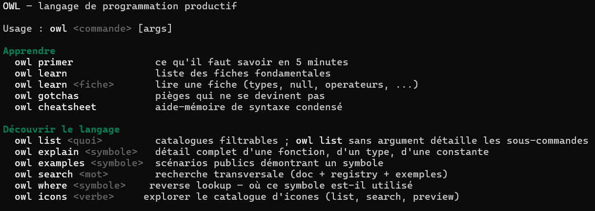

You can also write a file by hand — `hello.owl`:

```owl
sNom est une chaîne = "le monde"
Trace(`Bonjour, [%sNom%] !`)
```

---

## Editor

Visual Studio Code is the default supported editor. **Installing the OWL
extension is strongly recommended** for a comfortable, integrated editing
experience: syntax highlighting, autocompletion, live compiler information,
as-you-type diagnostics, format-on-save and visual designers.

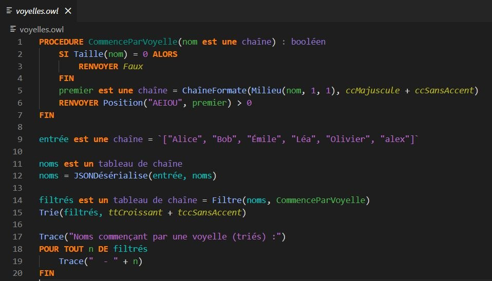

Shortcuts provided by the extension:

| Key | Action |
|---|---|
| `F9` | Run the current file |
| `Ctrl+F9` | Run the project |
| `Shift+F9` | Debug the current file |
| `F5` | Debug the project |
| `F11` | Open the visual designer (windows and reports) |
| `F1` | Open the documentation for the word under the cursor |
| `Ctrl+Alt+i` | Open the icon catalog |

All framework commands are also gathered in VS Code's **command palette**: press
`Ctrl+Shift+P`, then type `OWL` to list them (create an element, run, debug,
designers, documentation, icon catalog…), each with its shortcut — nothing to
memorize.

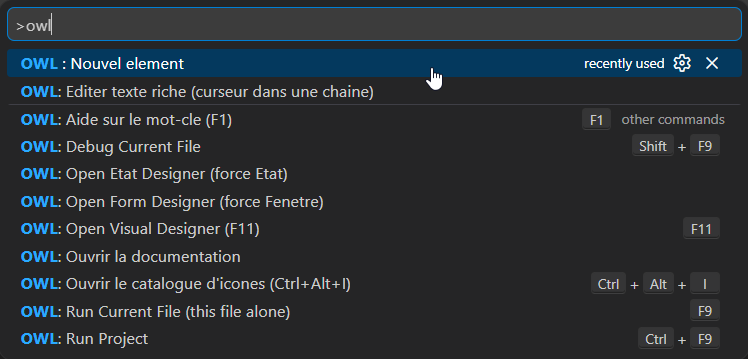

**Create without typing it all** — the **New element** command in the palette
opens a creation menu: pick a template — window, report, class, field — and the
skeleton is generated and opened in the editor. For a window, you choose the
field layout; for a report, the page format and orientation. (Command-line
equivalent: `owl new`.)

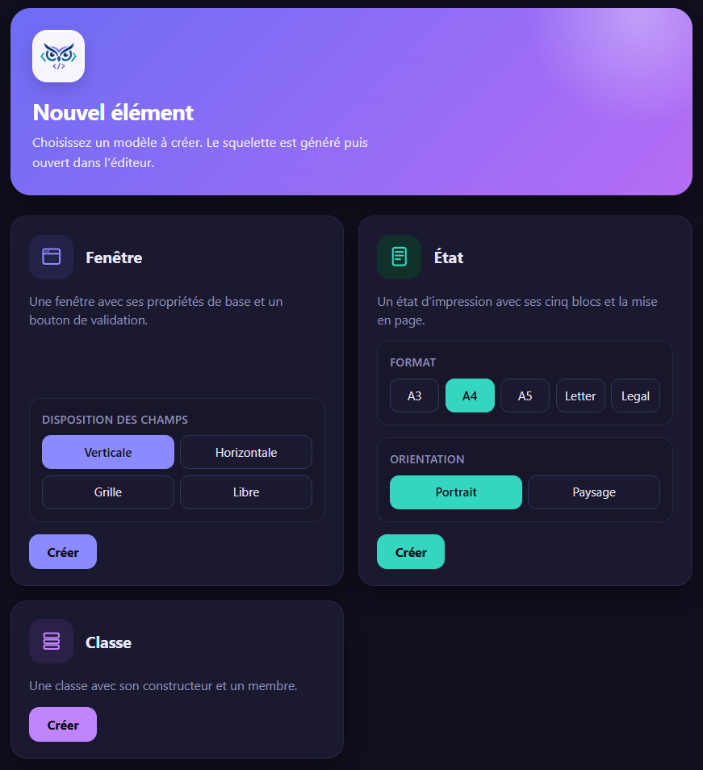

**Window designer** — a window is declared in its own `.owl` file, starting from
a minimal skeleton:

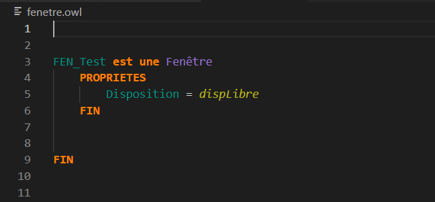

From there, two equivalent paths: keep typing, or open the **visual designer**
(`F11`) to compose the interface with the mouse.

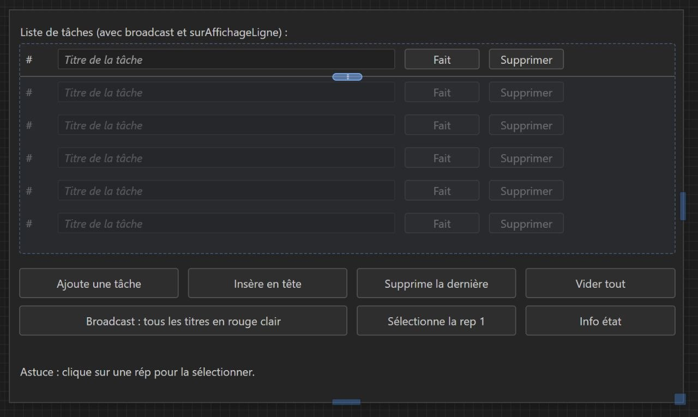

The designer and the code are **synchronized both ways**: what you draw is
written into the `.owl`, and what you edit in the code is immediately reflected
in the designer.

> **Layout mode.** The `Disposition` property drives how children are arranged:
> `dispLibre` places each element freely in X/Y (down to the pixel); `dispVerticale`,
> `dispHorizontale` and `dispGrille` instead delegate the arrangement to a
> container (automatic placement, no coordinates).

**Report designer** — lay out your printable documents (invoices, reports) in
blocks:

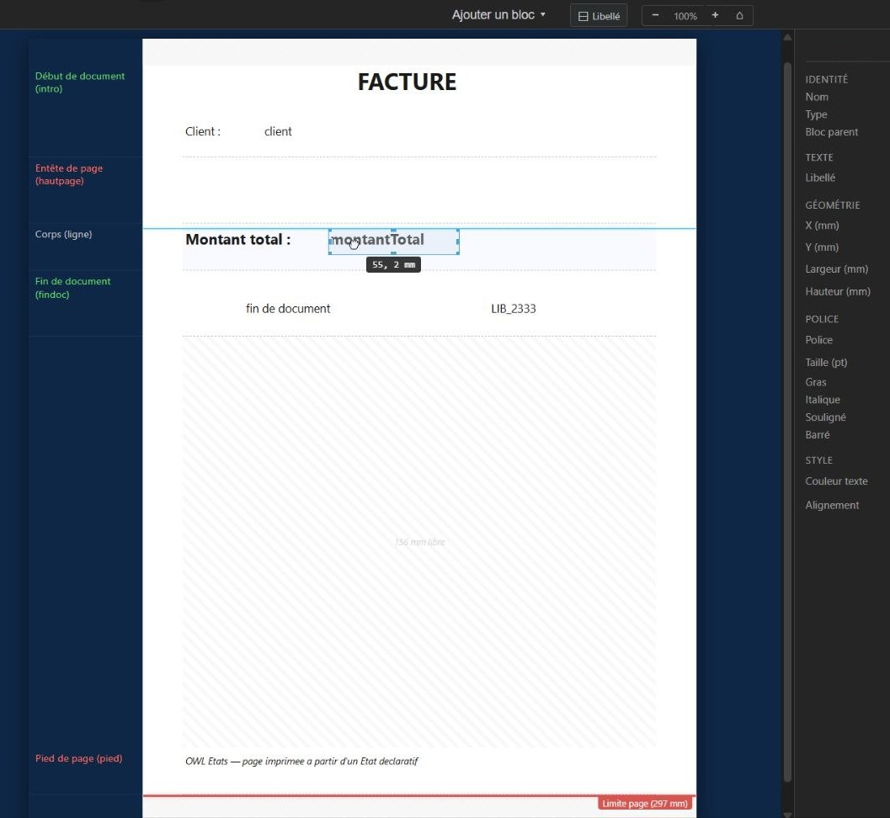

**Built-in icon catalog** — thousands of embedded icons, browsable and
insertable directly from the editor (or from the command line with `owl icons`):

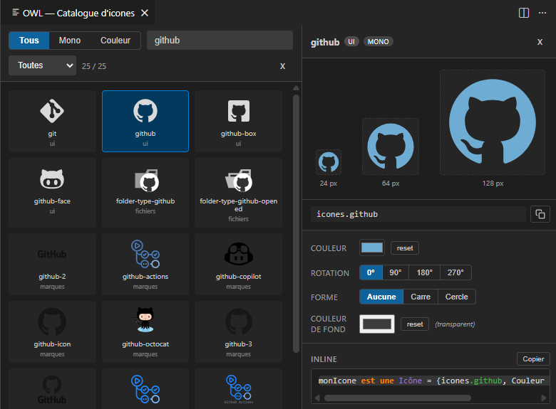

**Choose the assistance language** — `Ctrl+,` opens the settings; type `OWL` and
set **Owl: Language** (`fr` or `en`). The whole assistance then switches to the
chosen language: autocompletion, hover help and diagnostics.

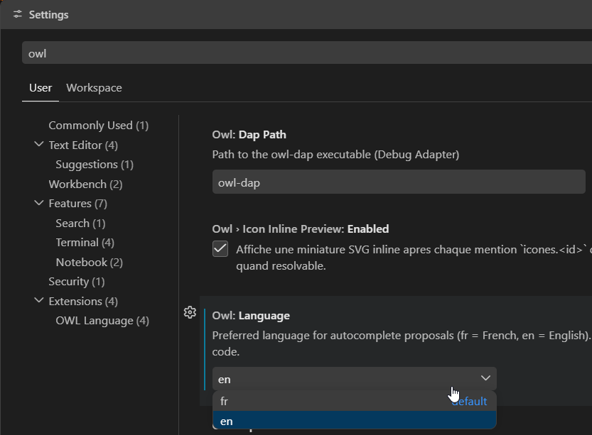

---

## Code organization

OWL links `.owl` files automatically, with no imports to declare. No
import/include to manage. A file's scope is determined at three levels:

- **Script** — the default mode: one or more flat `.owl` files.
  `owl mon_fichier.owl` runs the targeted file (and initializes its folder
  neighbors). `owl mon_fichier.owl --single` runs it **alone**, without neighbors.
- **Entry point** — a `main.owl` file containing a `main()` procedure
  designates, by convention, the entry point of a set of files; `owl` with no
  argument runs it.
- **Project** — a `projet.owl` file opens a fuller organization, with discovery
  of all subfolders.

---

## Exploring the language

The documentation comes from the core of the language and stays queryable
offline, in exactly the installed version:

| Command | Purpose |
|---|---|
| `owl primer` | The essentials in five minutes |
| `owl learn` | The fundamental guides (`owl learn types`, …) |
| `owl gotchas` | The pitfalls you can't guess |
| `owl cheatsheet` | The syntax quick reference |
| `owl explain <symbol>` | The full entry for a function, a type, a constant |
| `owl search <word>` | Cross-cutting search (documentation, catalog, examples) |
| `owl list` | The catalog of natives, types and constants |
| `owl examples <symbol>` | Examples demonstrating a symbol |

For example, `owl explain ChaîneVersDate` shows the full entry — signatures,
description and runnable examples:

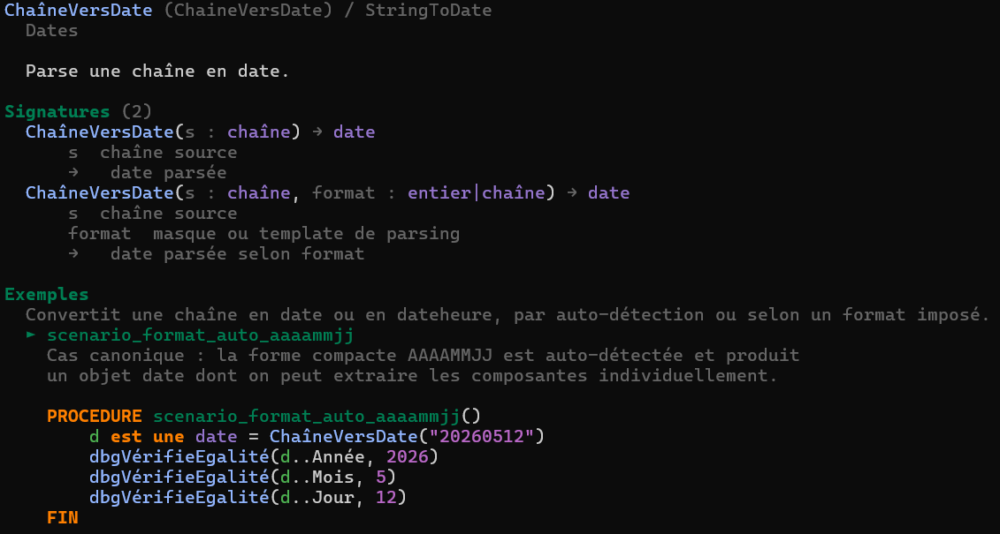

The same documentation is also available **offline in a browser** (`F1` in VS
Code, or from the Start menu), with bilingual FR / EN search:

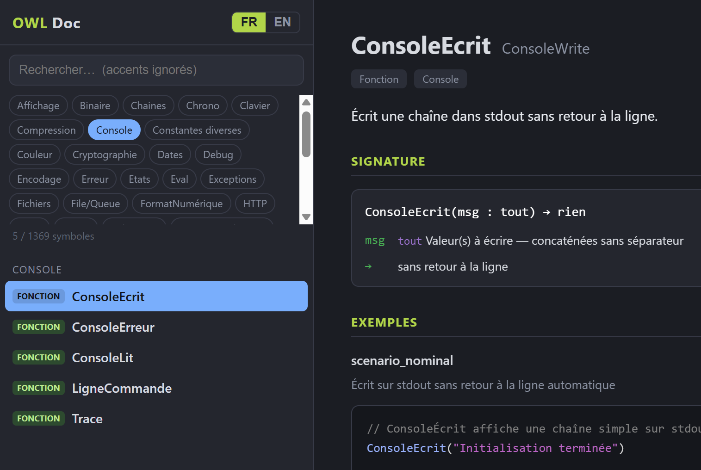

---

## Connecting an AI agent

NeOwl ships an **MCP** server (Model Context Protocol). An AI agent discovers the
language and framework there in seconds, in the installed version, to
**understand, explore and diagnose** code — with no external resource and no
guessing.

The server is the `owl mcp` command (`stdio` transport). Just declare it in the
agent's configuration; the agent takes care of launching it.

**Claude Code** — `.mcp.json` file at the project root:

```json
{
  "mcpServers": {
    "owl": { "type": "stdio", "command": "owl", "args": ["mcp"] }
  }
}
```

Command-line equivalent: `claude mcp add --transport stdio owl -- owl mcp`

**Cursor** — `.cursor/mcp.json` (project) or `~/.cursor/mcp.json` (global):

```json
{
  "mcpServers": {
    "owl": { "command": "owl", "args": ["mcp"] }
  }
}
```

**Windsurf** — `~/.codeium/windsurf/mcp_config.json`: same format (`mcpServers`).

**Claude Desktop** — `claude_desktop_config.json`: same format (`mcpServers`).

**Visual Studio Code** (built-in agent) — `.vscode/mcp.json`, with the `servers`
key:

```json
{
  "servers": {
    "owl": { "command": "owl", "args": ["mcp"] }
  }
}
```

For any other MCP-compatible client: declare a `stdio`-transport server running
the `owl mcp` command.

---

## Tests

```
owl test
```

NeOwl discovers `test_*.owl` files and runs them (current directory, and all
subdirectories when a `projet.owl` file is present at the root). Every file
following this naming convention is treated as a test file. An execution report
is displayed automatically at the end.

---

## Community

- FR channel: <https://t.me/neowl_fr>
- EN channel: <https://t.me/neowl_en>
- Discussion group: <https://t.me/+RuC4ayexheJkYTlk>
